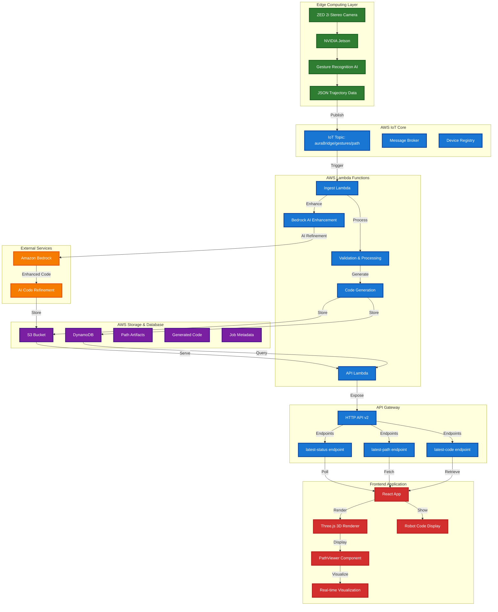
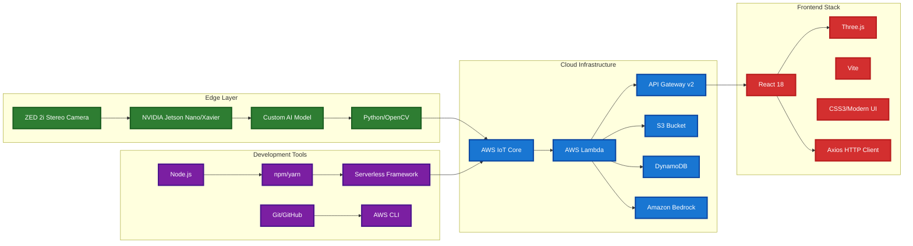

# Aura Bridge AI

End-to-end system that turns 3D hand gestures (ZED 2i on Jetson) into robot motion code (FANUC KAREL, KUKA KRL) and visualizes the path in a web UI. Backend validates, stores artifacts, and can refine code via Amazon Bedrock.

## 🏗️ Architecture



## 🛠️ Technology Stack



### **Edge Computing**
- **🎥 ZED 2i Camera**: Stereo depth camera for precise gesture recognition
- **🚀 NVIDIA Jetson**: Edge computing platform for real-time AI processing
- **🧠 Custom AI Model**: Trained gesture recognition for hand tracking
- **🐍 Python/OpenCV**: Computer vision and image processing

### **AWS Cloud Services**
- **📡 IoT Core**: Message broker for secure device communication
- **⚡ Lambda Functions**: Serverless compute for scalable processing
- **🌐 API Gateway**: HTTP API endpoints with CORS support
- **💾 S3**: Object storage for artifacts and generated code
- **🗄️ DynamoDB**: NoSQL database for job metadata and status
- **🤖 Bedrock**: AI service for optional code refinement

### **Frontend Technologies**
- **⚛️ React 18**: Modern web framework with hooks and context
- **🎨 Three.js**: 3D graphics library for path visualization
- **⚡ Vite**: Fast build tool and development server
- **💅 CSS3**: Modern styling with gradients and animations
- **📡 Axios**: HTTP client for API communication

## 📁 Project Structure

```
aura-bridge-ai/
├── src/
│   ├── App.jsx                 # Main application component
│   ├── components/
│   │   └── PathViewer.jsx      # 3D path visualization
│   └── main.jsx               # Application entry point
├── public/
│   ├── styles.css             # Enhanced styling
│   └── index.html             # HTML template
├── cloud/
│   ├── functions/
│   │   ├── ingest.js          # Data processing Lambda
│   │   └── api.js             # API endpoints Lambda
│   └── serverless.yml         # Infrastructure as code
└── README.md                  # This file
```

## 🚀 Quick Start

### Prerequisites
- Node.js 18+
- AWS CLI configured
- Serverless Framework

### Frontend Development
```bash
cd aura-bridge-ai
npm install
npm run dev
```

### Backend Deployment
```bash
cd cloud
npm ci
npx serverless deploy --stage prod --region us-east-1
```

### Environment Configuration
Create `.env` file:
```env
VITE_API_BASE=https://your-api-id.execute-api.us-east-1.amazonaws.com/prod
```

## 🎯 Features

### 3D Path Visualization
- Real-time trajectory rendering
- Waypoint spheres and path lines
- Grasp/release event markers
- Interactive camera controls
- Auto-fit to path bounds

### Robot Code Generation
- **FANUC KAREL**: Industrial robot programming
- **KUKA KRL**: Advanced robot control
- Real-time code updates
- Download functionality
- Code refinement with AI

### System Monitoring
- Validation status tracking
- Connection monitoring
- Error handling and recovery
- Real-time data polling

## 🔧 Configuration

### Environment Variables
- `VITE_API_BASE`: API Gateway endpoint URL
- `BEDROCK_ENABLED`: Enable AI code refinement
- `BEDROCK_MODEL`: Bedrock model selection
- `THING_NAME`: IoT device identifier

### API Endpoints
- `GET /latest/status` - System validation status
- `GET /latest/path` - Trajectory data and metadata
- `GET /latest/code` - Generated robot code

## 📊 Performance

- **Real-time Updates**: 2-5 second polling intervals
- **3D Rendering**: 60fps smooth visualization
- **Code Generation**: <1 second response time
- **Scalability**: Serverless auto-scaling

## 🤝 Contributing

1. Fork the repository
2. Create feature branch
3. Commit changes
4. Push to branch
5. Create Pull Request

## 📄 License

This project is licensed under the MIT License - see the LICENSE file for details.

## 🙏 Acknowledgments

- AWS for cloud infrastructure
- Three.js for 3D graphics
- React team for the framework
- NVIDIA for Jetson platform