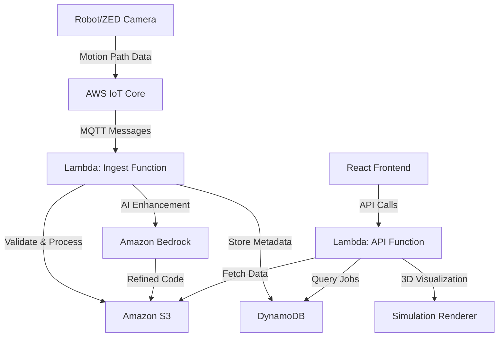

# Aura Bridge AI - The AI-Powered Universal Robot Translator

Aura Bridge AI is an innovative solution that bridges the gap between different robot programming languages by leveraging AWS AI services to automatically translate robot motion paths into multiple programming formats. This system enables seamless communication between different robotic systems, making industrial automation more accessible and interoperable.

## 🚀 Project Overview

Aura Bridge AI transforms robot motion data from IoT devices into standardized robot programming code for multiple platforms including FANUC KAREL and KUKA KRL. The system uses AWS Bedrock's AI capabilities to intelligently generate and refine robot programs, ensuring optimal motion planning and execution.

## 🏗️ Architecture

The system consists of three main components:

1. **Frontend (React + Three.js)** - Interactive 3D visualization and real-time monitoring
2. **Cloud Backend (AWS Serverless)** - IoT data processing and AI-powered code generation
3. **Local Development Server** - Mock server for development and testing

## ☁️ AWS Services Used

### Core Services
- **AWS Lambda** - Serverless compute for data processing and API endpoints
- **Amazon S3** - Object storage for robot paths, generated code, and artifacts
- **Amazon DynamoDB** - NoSQL database for job tracking and metadata
- **AWS IoT Core** - IoT message broker for robot data ingestion
- **Amazon Bedrock** - AI service for intelligent code generation and refinement

### Supporting Services
- **AWS API Gateway** - RESTful API endpoints
- **AWS IAM** - Fine-grained access control and permissions
- **AWS CloudFormation** - Infrastructure as Code deployment
- **Serverless Framework** - Simplified serverless application management

## 📊 Data Flow



### Detailed Data Flow:

1. **Data Ingestion**
   - Robot motion data is captured via ZED camera or robot sensors
   - Data is published to AWS IoT Core topic: `auraBridge/gestures/path`
   - IoT Core triggers the Lambda ingest function

2. **Data Processing**
   - Lambda function validates incoming path data
   - Converts coordinate systems (mm to meters)
   - Processes grasp/release events
   - Generates basic robot code (KAREL/KRL)

3. **AI Enhancement**
   - Optional Bedrock integration for code refinement
   - AI analyzes path complexity and optimizes motion
   - Generates more sophisticated robot programs

4. **Storage & Retrieval**
   - All artifacts stored in S3 with versioning
   - Job metadata tracked in DynamoDB
   - API endpoints provide real-time access to latest data

5. **Visualization**
   - React frontend polls API for updates
   - Three.js renders 3D path visualization
   - Real-time status monitoring and code display

## 🛠️ Technology Stack

### Frontend
- **React 18** - Modern UI framework
- **Three.js** - 3D graphics and visualization
- **Vite** - Fast build tool and dev server
- **CSS3** - Modern styling and animations

### Backend
- **Node.js 18** - JavaScript runtime
- **AWS SDK v3** - AWS service integration
- **Serverless Framework** - Infrastructure management
- **Express.js** - Local development server

### AI & ML
- **Amazon Bedrock** - Foundation model service
- **Claude 3 Haiku** - AI model for code generation
- **Custom prompts** - Robotics-specific AI instructions

## 📁 Project Structure

```
aura-bridge-ai/
├── aura-bridge-ai/          # React frontend application
│   ├── src/
│   │   ├── components/      # React components
│   │   ├── App.jsx         # Main application
│   │   └── threeRenderer.js # 3D visualization
│   └── package.json
├── cloud/                   # AWS serverless backend
│   ├── functions/          # Lambda functions
│   │   ├── api.js         # API endpoints
│   │   └── ingest.js      # IoT data processing
│   └── serverless.yml     # Infrastructure configuration
├── server/                 # Local development server
│   ├── src/index.js       # Express server
│   └── mock/              # Sample data
└── README.md              # This file
```

## 🚀 Getting Started

### Prerequisites
- Node.js 18+
- AWS CLI v2 configured
- Serverless Framework v3
- Git

### Installation

1. **Clone the repository**
   ```bash
   git clone https://github.com/dbharuka-sudo/aura-bridge-ai.git
   cd aura-bridge-ai
   ```

2. **Configure AWS CLI**
   ```bash
   aws configure
   # Enter your AWS Access Key ID, Secret Access Key, region, and output format
   ```

3. **Deploy Cloud Infrastructure**
   ```bash
   cd cloud
   npm install
   sls deploy --stage prod
   ```

4. **Set up Frontend**
   ```bash
   cd ../aura-bridge-ai
   npm install
   npm run dev
   ```

5. **Run Local Development Server**
   ```bash
   cd ../server
   npm install
   npm start
   ```

### Configuration

- Set `VITE_API_BASE` environment variable to your deployed API Gateway URL
- Configure IoT device to publish to the correct MQTT topic
- Adjust Bedrock model settings in `serverless.yml` if needed

## 🔧 Key Features

### Real-time Processing
- Live IoT data ingestion and processing
- Real-time 3D path visualization
- Instant code generation and validation

### Multi-Platform Support
- FANUC KAREL programming language
- KUKA KRL programming language
- Extensible architecture for additional platforms

### AI-Powered Enhancement
- Intelligent code optimization
- Context-aware motion planning
- Error detection and correction

### Scalable Architecture
- Serverless infrastructure
- Auto-scaling based on demand
- Cost-effective pay-per-use model

## 📈 Performance & Scalability

- **Latency**: Sub-second response times for API calls
- **Throughput**: Handles multiple concurrent IoT streams
- **Storage**: Efficient S3 storage with versioning
- **Cost**: Pay-per-use serverless model minimizes costs

## 🔒 Security

- IAM roles with least privilege access
- S3 bucket policies for secure data access
- IoT device authentication and authorization
- API Gateway request validation

## 🤝 Contributing

1. Fork the repository
2. Create a feature branch
3. Make your changes
4. Add tests if applicable
5. Submit a pull request

## 📄 License

This project is licensed under the MIT License - see the LICENSE file for details.

## 🙏 Acknowledgments

- AWS for providing comprehensive cloud services
- Anthropic for Claude AI model capabilities
- Three.js community for 3D visualization tools
- React community for modern UI framework

## 📞 Support

For questions or support, please open an issue in the GitHub repository or contact the development team.

---

**Built with ❤️ for the AWS XINIX Hackathon 2025**
